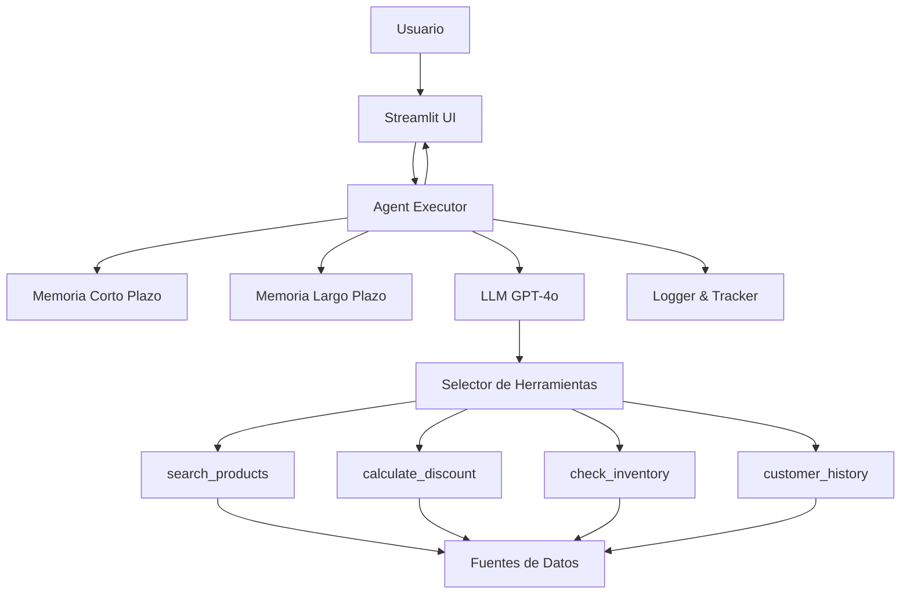

# 🤖 Diagrama de Orquestación - Sistema de Agente Inteligente

## Arquitectura ReAct (Reasoning + Acting)

```
┌─────────────────────────────────────────────────────────────────────────┐
│                         USUARIO (Streamlit UI)                          │
│                     "Muéstrame tortas de chocolate"                     │
└────────────────────────────────┬────────────────────────────────────────┘
                                 │
                                 ▼
┌─────────────────────────────────────────────────────────────────────────┐
│                    INTERFAZ STREAMLIT (app_agent.py)                    │
│  - Captura consulta del usuario                                         │
│  - Gestiona sesión y estado                                             │
│  - Visualiza resultados y trazas                                        │
└────────────────────────────────┬────────────────────────────────────────┘
                                 │
                                 ▼
┌─────────────────────────────────────────────────────────────────────────┐
│              ORQUESTADOR PRINCIPAL (PasteleriaAgentExecutor)            │
│  Responsabilidad: Coordinar todo el flujo de ejecución                  │
└────────────────────────────────┬────────────────────────────────────────┘
                                 │
                    ┌────────────┴────────────┐
                    │                         │
                    ▼                         ▼
    ┌───────────────────────────┐  ┌──────────────────────────┐
    │   MEMORIA DE CORTO PLAZO  │  │  MEMORIA DE LARGO PLAZO  │
    │   (ConversationBuffer)    │  │  (ChromaDB + Embeddings) │
    │                           │  │                          │
    │  - Historial de sesión    │  │  - Conversaciones        │
    │  - Contexto inmediato     │  │    previas               │
    │  - Preferencias actuales  │  │  - Patrones de uso       │
    └───────────────────────────┘  │  - Preferencias cliente  │
                                    └──────────────────────────┘
                                 │
                                 ▼
┌─────────────────────────────────────────────────────────────────────────┐
│                    AGENTE ReAct (LangChain Agent)                       │
│  Arquitectura: Reasoning (Pensamiento) + Acting (Acción)               │
│                                                                         │
│  CICLO DE RAZONAMIENTO:                                                 │
│  ┌──────────────────────────────────────────────────────────────────┐  │
│  │ 1. THOUGHT: Analizo qué necesito hacer                           │  │
│  │    "Necesito buscar productos de chocolate en el catálogo"       │  │
│  │                                                                   │  │
│  │ 2. ACTION: Selecciono herramienta apropiada                      │  │
│  │    Tool: search_products                                         │  │
│  │                                                                   │  │
│  │ 3. ACTION INPUT: Preparo parámetros                              │  │
│  │    {"query": "chocolate", "category": "tortas"}                  │  │
│  │                                                                   │  │
│  │ 4. OBSERVATION: Recibo resultado de la herramienta               │  │
│  │    [TC001, PV001, ...] - 5 productos encontrados                 │  │
│  │                                                                   │  │
│  │ 5. THOUGHT: Evalúo si necesito más información                   │  │
│  │    "Tengo suficiente información, puedo responder"               │  │
│  │                                                                   │  │
│  │ 6. FINAL ANSWER: Genero respuesta al usuario                     │  │
│  └──────────────────────────────────────────────────────────────────┘  │
│                                                                         │
│  Powered by: GPT-4o (GitHub Models) o GPT-3.5-turbo (OpenAI)          │
└────────────────────────────────┬────────────────────────────────────────┘
                                 │
                    ┌────────────┴────────────┐
                    │  SELECTOR DE HERRAMIENTAS│
                    └────────────┬─────────────┘
                                 │
        ┌────────────┬───────────┼───────────┬────────────┐
        │            │           │           │            │
        ▼            ▼           ▼           ▼            ▼
┌──────────────┐ ┌─────────┐ ┌──────────┐ ┌──────────────────┐
│   TOOL 1:    │ │ TOOL 2: │ │ TOOL 3:  │ │    TOOL 4:       │
│   SEARCH     │ │CALCULATE│ │  CHECK   │ │   CUSTOMER       │
│  PRODUCTS    │ │DISCOUNT │ │INVENTORY │ │   HISTORY        │
│              │ │         │ │          │ │                  │
│ Busca en el  │ │Calcula  │ │Verifica  │ │Recupera historial│
│ catálogo de  │ │descuentos│ │disponib. │ │y preferencias    │
│ productos    │ │aplicables│ │y stock   │ │del cliente       │
└──────┬───────┘ └────┬────┘ └────┬─────┘ └────┬─────────────┘
       │              │           │            │
       └──────────────┴───────────┴────────────┘
                      │
                      ▼
┌─────────────────────────────────────────────────────────────────────────┐
│                    FUENTES DE DATOS (Data Layer)                        │
│                                                                         │
│  ┌──────────────────┐  ┌──────────────────┐  ┌───────────────────┐   │
│  │ productos.json   │  │ clientes_        │  │ historial_        │   │
│  │                  │  │ ejemplos.csv     │  │ ejemplos.csv      │   │
│  │ • Catálogo       │  │                  │  │                   │   │
│  │ • Precios        │  │ • Edades         │  │ • Compras previas │   │
│  │ • Categorías     │  │ • Emails DUOC    │  │ • Preferencias    │   │
│  │ • Ingredientes   │  │ • Segmentos      │  │ • Historial       │   │
│  └──────────────────┘  └──────────────────┘  └───────────────────┘   │
│                                                                         │
│  ┌──────────────────┐  ┌──────────────────┐                           │
│  │ politicas_       │  │ faqs.json        │                           │
│  │ descuentos.md    │  │                  │                           │
│  │                  │  │ • Preguntas freq.│                           │
│  │ • Descuentos     │  │ • Respuestas     │                           │
│  │ • Promociones    │  │ • Políticas      │                           │
│  │ • Condiciones    │  │                  │                           │
│  └──────────────────┘  └──────────────────┘                           │
└─────────────────────────────────────────────────────────────────────────┘
                      │
                      ▼
┌─────────────────────────────────────────────────────────────────────────┐
│                    SISTEMA DE LOGGING Y TRACKING                        │
│                                                                         │
│  ┌────────────────────────┐  ┌──────────────────────────────────────┐ │
│  │   AgentLogger          │  │   ExecutionTracker                   │ │
│  │   (logs/agent_*.log)   │  │                                      │ │
│  │                        │  │   • Tiempo de ejecución              │ │
│  │   • Queries            │  │   • Herramientas usadas              │ │
│  │   • Respuestas         │  │   • Número de iteraciones            │ │
│  │   • Errores            │  │   • Estado (éxito/error)             │ │
│  │   • Traces completos   │  │   • Métricas de performance          │ │
│  └────────────────────────┘  └──────────────────────────────────────┘ │
└─────────────────────────────────────────────────────────────────────────┘
                      │
                      ▼
┌─────────────────────────────────────────────────────────────────────────┐
│                        RESPUESTA AL USUARIO                             │
│                                                                         │
│  ┌──────────────────────────────────────────────────────────────────┐  │
│  │ RESPUESTA ESTRUCTURADA:                                          │  │
│  │                                                                   │  │
│  │ • Texto de respuesta natural                                     │  │
│  │ • Productos encontrados (con detalles)                           │  │
│  │ • Herramientas utilizadas (badges)                               │  │
│  │ • Proceso de razonamiento (expandible)                           │  │
│  │ • Métricas: tiempo, iteraciones, estado                          │  │
│  └──────────────────────────────────────────────────────────────────┘  │
└─────────────────────────────────────────────────────────────────────────┘
```

---

## 🔄 Flujo de Ejecución Detallado

### Fase 1: RECEPCIÓN DE CONSULTA
```
Usuario → Streamlit UI → IntelligentPasteleriaApp.process_query()
```

### Fase 2: PREPARACIÓN DE CONTEXTO
```
1. Recuperar memoria corto plazo (historial de sesión)
2. Buscar conversaciones similares en memoria largo plazo
3. Construir contexto enriquecido
```

### Fase 3: ORQUESTACIÓN DEL AGENTE (ReAct Loop)
```
PasteleriaAgentExecutor.execute()
  │
  ├─> LLM analiza consulta (THOUGHT)
  │
  ├─> Selecciona herramienta apropiada (ACTION)
  │   Options: [search_products, calculate_discount, 
  │             check_inventory, customer_history]
  │
  ├─> Ejecuta herramienta con parámetros (ACTION INPUT)
  │
  ├─> Recibe resultado (OBSERVATION)
  │
  ├─> Evalúa si necesita más acciones (THOUGHT)
  │   │
  │   ├─ SÍ → Vuelve al paso 2 (nueva iteración)
  │   │
  │   └─ NO → Genera respuesta final (FINAL ANSWER)
  │
  └─> Retorna resultado estructurado
```

### Fase 4: ALMACENAMIENTO EN MEMORIA
```
1. Guardar en memoria corto plazo (buffer de sesión)
2. Vectorizar y almacenar en memoria largo plazo (ChromaDB)
3. Registrar metadata (herramientas usadas, tiempo, etc.)
```

### Fase 5: LOGGING Y TRACKING
```
1. AgentLogger registra toda la interacción
2. ExecutionTracker captura métricas de performance
3. Traza de ejecución guardada para análisis
```

### Fase 6: RENDERIZADO EN UI
```
1. Mostrar respuesta al usuario
2. Visualizar herramientas utilizadas (badges)
3. Expandir proceso de razonamiento (trace)
4. Mostrar métricas (tiempo, iteraciones, estado)
```

---

## 📊 Componentes Clave y Responsabilidades

### 1. **Orquestador Principal** (`PasteleriaAgentExecutor`)
- ✅ Coordina flujo completo de ejecución
- ✅ Gestiona ciclo ReAct
- ✅ Maneja errores y reintentos
- ✅ Recopila métricas de ejecución

### 2. **Sistema de Herramientas** (4 Tools)
- 🔍 **SearchProductsTool**: Búsqueda inteligente en catálogo
- 💰 **CalculateDiscountTool**: Cálculo de descuentos (3 tipos)
- 📦 **CheckInventoryTool**: Verificación de disponibilidad
- 👤 **CustomerHistoryTool**: Recuperación de preferencias

### 3. **Sistema de Memoria Dual**
- 🧠 **Corto Plazo**: Buffer conversacional (sesión activa)
- 💾 **Largo Plazo**: Vector store persistente (ChromaDB)

### 4. **Motor LLM**
- 🤖 GPT-4o (GitHub Models - GRATIS)
- 🤖 GPT-3.5-turbo (OpenAI - PAGO)
- 📝 Temperatura: 0.3 (balance creatividad/precisión)

### 5. **Sistema de Observabilidad**
- 📊 Logging completo de interacciones
- ⏱️ Tracking de performance
- 🔍 Trazabilidad de decisiones

---

## 🎯 Ejemplo de Ejecución Real

**Consulta**: "Muéstrame todas las tortas de chocolate disponibles"

### Traza de Ejecución:

```
ITERACIÓN 1:
┌─────────────────────────────────────────────────────┐
│ THOUGHT: Necesito buscar productos de chocolate     │
│          en la categoría de tortas                  │
└─────────────────────────────────────────────────────┘
           ↓
┌─────────────────────────────────────────────────────┐
│ ACTION: search_products                             │
└─────────────────────────────────────────────────────┘
           ↓
┌─────────────────────────────────────────────────────┐
│ ACTION INPUT:                                       │
│ {                                                   │
│   "query": "chocolate tortas",                      │
│   "category": "tortas"                              │
│ }                                                   │
└─────────────────────────────────────────────────────┘
           ↓
┌─────────────────────────────────────────────────────┐
│ OBSERVATION:                                        │
│ Encontrados 5 productos:                            │
│ - TC001: Torta Cuadrada de Chocolate ($45,000)     │
│ - PV001: Torta Vegana de Chocolate ($52,000)       │
│ - TC003: Torta Cuadrada Triple Chocolate ($55,000) │
│ - TT003: Torta Circular Chocolate Frambuesa ($48k) │
│ - PI001: Mousse de Chocolate ($5,000)              │
└─────────────────────────────────────────────────────┘
           ↓
┌─────────────────────────────────────────────────────┐
│ THOUGHT: Tengo toda la información necesaria.       │
│          Puedo presentar los resultados al cliente  │
└─────────────────────────────────────────────────────┘
           ↓
┌─────────────────────────────────────────────────────┐
│ FINAL ANSWER:                                       │
│ ¡Claro! Tenemos 5 deliciosas opciones de chocolate:│
│                                                     │
│ 🍫 Torta Cuadrada de Chocolate - $45,000          │
│    Chocolate con ganache y avellanas              │
│                                                     │
│ 🌱 Torta Vegana de Chocolate - $52,000            │
│    100% vegana, chocolate belga                    │
│ ...                                                 │
└─────────────────────────────────────────────────────┘
```

**Métricas**:
- ⏱️ Tiempo: 2.3 segundos
- 🔄 Iteraciones: 1
- 🛠️ Herramientas: search_products
- ✅ Estado: Éxito

---

## 🎨 Para Presentación Visual

### Opción 1: Usar Draw.io o Lucidchart
1. Importa este diagrama como texto
2. Usa formas rectangulares para componentes
3. Flechas para flujo de datos
4. Colores:
   - 🔵 Azul: Componentes principales
   - 🟢 Verde: Herramientas
   - 🟡 Amarillo: Memoria
   - 🔴 Rojo: Datos
   - ⚪ Gris: UI/Logging

### Opción 2: Usar Mermaid (en Markdown)


### Opción 3: PowerPoint
- Slide 1: Arquitectura general
- Slide 2: Ciclo ReAct detallado
- Slide 3: Herramientas y responsabilidades
- Slide 4: Ejemplo de ejecución con trace

---

## ✅ Criterios de Evaluación Cubiertos

**Orquestación de Agente con Herramientas (20%)**:
- ✅ 4 herramientas implementadas con LangChain
- ✅ Arquitectura ReAct clara
- ✅ Coordinación automática de herramientas

**Sistema de Memoria (20%)**:
- ✅ Memoria corto plazo (buffer)
- ✅ Memoria largo plazo (vector store)
- ✅ Integración con agente

**Planificación y Toma de Decisiones (20%)**:
- ✅ Ciclo de razonamiento explícito
- ✅ Selección inteligente de herramientas
- ✅ Iteraciones hasta completar objetivo

**Mejoras al Aplicativo (40%)**:
- ✅ UI mejorada con visualización de trace
- ✅ Métricas de ejecución
- ✅ Logging y tracking completo

---

¿Necesitas que ajuste algo del diagrama o que te genere una versión en otro formato?
